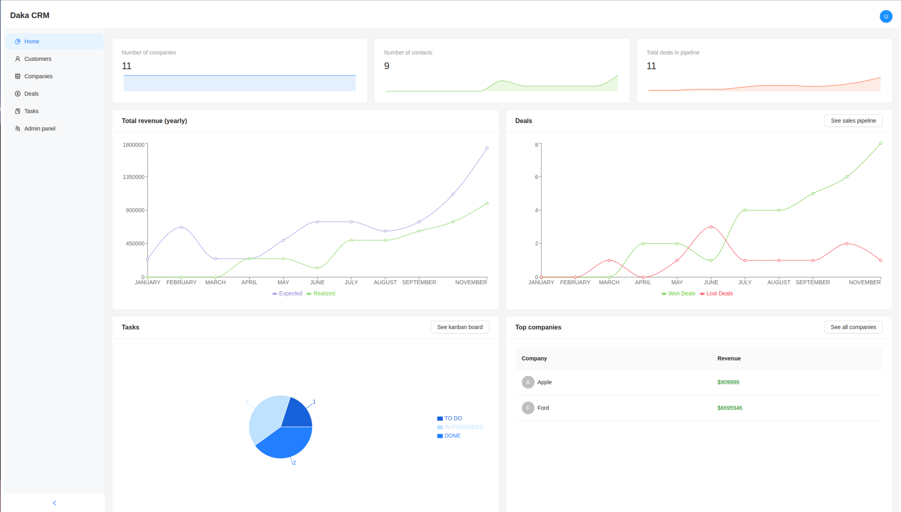

# Daka CRM

Daka CRM is a customer relationship management system designed to streamline the management of deals, customers, and company interactions. It features an intuitive UI, robust backend support, and is tailored for businesses of any size to optimize their workflow.

## Features

- **Customer Management**
- **Deal Tracking**
- **Tasks Tracking**
- **Dashboard**
- **Admin panel**

## Technology Stack

### Frontend
- **React.js** with **TypeScript** for dynamic and type-safe UI.
- **Ant Design** for modern, responsive components.
- **Vite** for rapid development and build optimization.

### Backend
- **Spring Boot** with **Kotlin** for a robust API.
- **MySQL** as the relational database.

### Additional Tools
- **Node.js** for backend services.
- **Stripe SDK** for payment webhooks processing.
- **Docker** for container deployment.

## Installation

### Prerequisites
- Node.js 22+ and npm installed
- Java 21+ for the backend
- MySQL 8+ for the database
